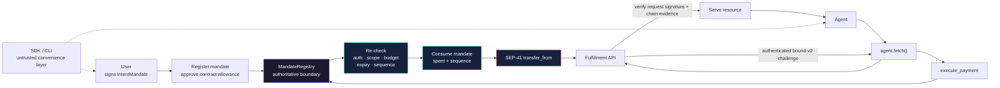

# ⚡ ackrate-protocol

**Protocol, SDK, CLI, and reference agents for mandate-enforced agent payments on Stellar. The SDK prepares requests; the contract decides whether money moves.**

[](https://stellar.expert/explorer/public/contract/CCLZEBJXG4YVJEPBCR5F27N733BCK5HQJWZZGB3K54JVODY3VAGP4HWR)
[](https://github.com/ackrate/ackrate-protocol/actions/workflows/ci.yml)
[](packages/sdk)
[](https://www.npmjs.com/package/@ackrate/core)
[](docs/x402-roundtrip.md)

---

## 🔒 One Enforced Payment Path

A user defines the budget and scope. An agent can request payment, but only the MandateRegistry can validate, consume, and transfer against that authorization.



> **Mainnet invariant:** money moves only through `MandateRegistry.execute_payment`, which validates and consumes the mandate atomically with its transfer. The user approves the SEP-41 allowance for the **contract**, never for the agent, SDK, or CLI. Historical composite contracts have their own separately documented payment interface.

---

## Why Ackrate Is Different

| Property | Protocol guarantee |
|---|---|
| Contract-authoritative limits | Budget, merchant scope, asset, expiry, caller authorization, and sequence are re-checked on every payment. |
| Atomic enforcement | Mandate consumption and token transfer happen in one transaction; a failed transfer reverts the state change. |
| SDK cannot bypass policy | The SDK and CLI hold no spending authority. They submit requests to the same contract boundary as any other caller. |
| Replay resistance | Every spend supplies the current mandate sequence; stale and out-of-order calls are rejected. |
| Bound HTTP delivery | Exact-origin GET challenges, agent signatures, pre-broadcast receipts, explicit application acknowledgment, and atomic claim plus immutable-result replay close public-transaction reuse. |
| Adaptable HTTP layer | x402 request and response parsing is isolated from the mandate model and contract interface. |
| Controlled evolution | Mainnet V2 supports native 2-of-3 administration, pause, and authorized same-address implementation upgrades. |

---

## Mainnet deployment configuration

The current Mainnet V2 registry is
[`CCLZEBJXG4YVJEPBCR5F27N733BCK5HQJWZZGB3K54JVODY3VAGP4HWR`](https://stellar.expert/explorer/public/contract/CCLZEBJXG4YVJEPBCR5F27N733BCK5HQJWZZGB3K54JVODY3VAGP4HWR).
The coordinated release makes this the default Mainnet target through `MAINNET`
from `@ackrate/stellar@0.3.0`, `ackrate.mainnet` in Core, and the rebuilt CLI.
The complete official manifest is bundled; users do not need to copy the address
or supply a separate manifest file. Source and artifact identity remain pinned
alongside the address.

See the [five-package Mainnet configuration map](docs/mainnet-configuration.md)
for Stellar **0.3.0**, Core **0.4.0**, AP2 **0.4.0**, Express middleware **0.3.0**,
and CLI **0.2.0**, including the exact configuration file and clickable contract
explorer links. These coordinated versions are pending publication; status is below.

```ts
import { MAINNET } from "@ackrate/stellar";
import { ackrate } from "@ackrate/core";

console.log(MAINNET.mandateRegistryId);
console.log(ackrate.mainnet.settlementAsset.contractId); // Canonical Mainnet USDC.
```

Mainnet uses real USDC and XLM fees. A default configuration is not permission
to spend: user/agent signatures, budget approval, live-state checks, and the CLI's
real-USDC confirmation guards remain required. The advanced
`publishedMainnetNetworkFromDeploymentManifest` helper validates a supplied
complete record against this official deployment; it is not required to use the
bundled Mainnet profile. Authorized upgrades replace the implementation at the
same contract address, with compatibility and release-evidence review still required.

V2 administration uses native Stellar 2-of-3 account authorization. Upgrades
require administrator authorization and paused state. This V2 deployment has
no integrated timelock and does not use the older registry's OpenZeppelin role
implementation. The separate older contracts remain documented under their own
addresses and profiles. See the [Stellar package configuration](packages/stellar/README.md)
and [signature-coordination commands](packages/cli/README.md#two-signature-coordination).

## 🌐 Mainnet Packages and Applications

| Surface | Current source or deployment |
|---|---|
| Mainnet V2 MandateRegistry | [`CCLZEBJX…4HWR`](https://stellar.expert/explorer/public/contract/CCLZEBJXG4YVJEPBCR5F27N733BCK5HQJWZZGB3K54JVODY3VAGP4HWR) — the official default registry, native 2-of-3 administration, and same-address upgrades |
| Hosted wallet workflow | [Wallet demo project](https://github.com/ackrate/ackrate-protocol-demo) — user-signed setup, mandate-validated payments, and service results |
| Contract releases and hashes | [`ackrate-protocol-contracts`](https://github.com/ackrate/ackrate-protocol-contracts) |
| High-level SDK | [`@ackrate/core`](https://www.npmjs.com/package/@ackrate/core) — mandates, payments, and `agent.fetch()` |
| Stellar binding | [`@ackrate/stellar`](https://www.npmjs.com/package/@ackrate/stellar) — typed contract client, network config, signers, and SEP-41 helpers |
| AP2 profile | [`@ackrate/ap2`](https://www.npmjs.com/package/@ackrate/ap2) — signed, version-pinned AP2 v0.1 validation plus fail-closed binding into the contract mandate |
| Express middleware | [`@ackrate/express-middleware`](https://www.npmjs.com/package/@ackrate/express-middleware) — authenticated bound-v2 challenges, independent settlement verification, and a paid JSON route with atomic claim plus immutable-result replay |
| CLI | [`@ackrate/cli`](https://www.npmjs.com/package/@ackrate/cli) — setup, mandate creation, crash-safe payment reconciliation, exact success acknowledgment, and demo flow |

### Published packages and coordinated release status

Package releases and protocol/specification versions are separate axes.
Registry verification on **2026-09-07 at 03:33 Bangkok (UTC+7)** found Stellar
**0.2.5**, Core **0.3.4**, AP2 **0.3.2**, middleware **0.2.4**, and CLI **0.1.9**
publicly available. All five newer coordinated Mainnet-default versions below
are pending publication and public clean-install verification. Do not attribute
their new defaults or APIs to those older npm releases.

| Package | Public npm version | Coordinated version | Protocol/specification target |
|---|---:|---:|---|
| `@ackrate/stellar` | `0.2.5` | `0.3.0` — pending | Built-in official `MAINNET`, complete manifest, and contract access |
| `@ackrate/core` | `0.3.4` | `0.4.0` — pending | Mainnet-default mandates, payments, and delivery recovery |
| `@ackrate/ap2` | `0.3.2` | `0.4.0` — pending | AP2 `0.1.0` profile bridged into the Mainnet Core flow |
| `@ackrate/express-middleware` | `0.2.4` | `0.3.0` — pending | Mainnet USDC bound-v2 proof verification and durable delivery |
| `@ackrate/cli` | `0.1.9` | `0.2.0` — pending | Mainnet-default `ackrate` command with the official manifest bundled |

The coordinated set requires **Node.js 22 or newer** and uses the exact
`@stellar/stellar-sdk@16.3.0` dependency. AP2 candidate `0.4.0` still implements
the AP2 `0.1.0` profile; the package version is not the specification version.
See the [package release matrix](docs/ackrate-sdk-npm.md) for installation status.

The contract is authoritative. SDK-side checks only fail fast; they never replace on-chain validation.

---

## 📁 Repository Map

| Path | Purpose |
|---|---|
| [`packages/sdk`](packages/sdk) | `@ackrate/core`: contract client, bound-v2 adapter, durable settlement receipts, and no-second-payment recovery |
| [`packages/stellar`](packages/stellar) | `@ackrate/stellar`: generated binding, network config, signer, and token helpers |
| [`packages/ap2`](packages/ap2) | `@ackrate/ap2`: signed AP2 v0.1 Ackrate profile validator with deterministic binding evidence and 59 tests |
| [`packages/express-middleware`](packages/express-middleware) | `@ackrate/express-middleware`: exact-origin GET verification and at-most-once paid JSON fulfillment |
| [`packages/cli`](packages/cli) | `@ackrate/cli`: terminal workflow, pre-broadcast journal, exact-hash reconciliation, and explicit success acknowledgment |
| [`apps/consumer-agent`](apps/consumer-agent) | Reference ResearchAgent that buys data through `agent.fetch()` |
| [`apps/fulfillment-agent`](apps/fulfillment-agent) | Reference 402-gated API that verifies settlement before serving |
| [`apps/wallet-chat`](apps/wallet-chat) | Next.js + LOBSTR wallet flow and mandate-aware AI consumer chat |
| [`scripts`](scripts) | Testnet demos, live flows, deployment, and gate check tooling |
| [`security`](security) | Threat model, data flows, upgrade custody, and contract/SDK/x402 gate check records |

---

## 🚀 Run the Flow

Use **Node.js 22+**. Build and verify the current candidate from this checkout:

```bash
npm ci
npm run gatecheck:release
```

The source Mainnet workflow needs existing funded actors and named secure
signers. Replace the example identities and merchant address before running;
the fully configured command spends real USDC:

```bash
npm run cli:bundle
node packages/cli/dist/ackrate-cli.bundle.mjs demo research-agent \
  --network mainnet \
  --user-signer ackrate-user --agent-signer ackrate-agent \
  --agent-secret-env ACKRATE_AGENT_SECRET \
  --merchant G... --price 0.01 --budget 0.03 --confirm-real-usdc
```

The flag `--agent-secret-env` names an environment variable injected by a secret
manager; never substitute the secret value into the command. The official
Mainnet manifest is bundled. No manual manifest file is needed for this registry.

After `@ackrate/cli@0.2.0` is published and clean-install verified, use
`npx --yes @ackrate/cli@0.2.0` in place of the local bundle command, retaining the
same signer, merchant, price, budget, and confirmation options. This candidate
is not yet a verified public npm release.

The command starts both reference agents and delivers three resources through
HTTP 402, on-chain payment, independent proof verification, and HTTP 200. The
contract must reject purchase four without payment. Follow the full
[CLI prerequisites and recovery instructions](docs/cli.md). A new Mainnet
reference-agent delivery run remains separate from historical direct-payment
receipts, local tests, or the hosted marketplace's human test.

### Explicit development networks and historical evidence

Existing development deployments and evidence are retained separately from the
official Mainnet default:

- [Simple development registry CCHQ5G4Y…CZRM](https://stellar.expert/explorer/testnet/contract/CCHQ5G4Y4YBMY6D3TYYJSVJVCKUM22Q6TMKCCHVAHY4X7K6QELQACZRM).
- [Composite development registry CCYRF7FK…HEYW](https://stellar.expert/explorer/testnet/contract/CCYRF7FKYGSNWX5I7WLYXZ6LNUNVCSPE4BOTQFVWVTABOHAP52DYHEYW).

To explicitly run the funded development-network reference flow:

```bash
npm run agents:testnet
```

That command creates and funds fresh testnet actors, starts the Express
fulfillment agent, and drives the consumer through real `agent.fetch()`
purchases. Three resources settle and are independently verified; the fourth is
rejected by the contract-enforced budget. The run also proves exact bound-v2
receipts and rejects an old settlement re-signed for a fresh request. No local
key or environment file is required.

Run the three named SDK failure drills separately:

```bash
npm run drills:testnet
```

Use the public browser companion at [ackrate.live/express](https://ackrate.live/express),
or follow the verified [clean VS Code project guide](docs/express-vscode-quickstart.md).
Operational evidence and boundaries are in the [live drill record](docs/live-failure-drills.md),
[threat model](security/threat-model.md), [data flow](security/data-flow.md), and
[upgrade authority runbook](security/upgrade-authority.md).

*The SDK is untrusted. The contract enforces the limit.*
