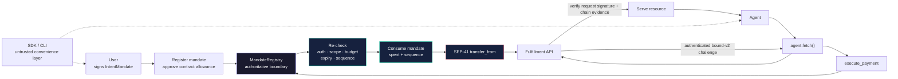

# ⚡ ackrate-protocol

**Protocol, SDK, CLI, and reference agents for mandate-enforced agent payments on Stellar. The SDK prepares requests; the contract decides whether money moves.**

[](https://stellar.expert/explorer/public/contract/CCLZEBJXG4YVJEPBCR5F27N733BCK5HQJWZZGB3K54JVODY3VAGP4HWR)
[](https://github.com/ackrate/ackrate-protocol/actions/workflows/ci.yml)
[](packages/sdk)
[](https://www.npmjs.com/package/@ackrate/core)
[](docs/x402-roundtrip.md)

---

## 🔒 One Enforced Payment Path

A user defines the budget and scope. An agent can request payment, but only the MandateRegistry can validate, consume, and transfer against that authorization.


```mermaid
flowchart LR
    U["User\nsigns IntentMandate"] --> R["Register mandate\napprove contract allowance"]
    R --> C["MandateRegistry\nauthoritative boundary"]

    A["Agent"] --> F["agent.fetch()"]
    F --> M["Fulfillment API"]
    M -->|"authenticated bound-v2 challenge"| F
    F --> P["execute_payment"]
    P --> C

    C --> V["Re-check\nauth · scope · budget\nexpiry · sequence"]
    V --> X["Consume mandate\nspent + sequence"]
    X --> T["SEP-41 transfer_from"]
    T --> M
    M -->|"verify request signature + chain evidence"| D["Serve resource"]
    D --> A

    SDK["SDK / CLI\nuntrusted convenience layer"] -.-> A
    SDK -.-> U

    style C fill:#1a1a2e,stroke:#7B73FF,color:#fff
    style V fill:#16213e,stroke:#00d9a5,color:#fff
    style X fill:#16213e,stroke:#00d9a5,color:#fff
    style T fill:#16213e,stroke:#e94560,color:#fff
```

> **Mainnet invariant:** money moves only through `MandateRegistry.execute_payment`, which validates and consumes the mandate atomically with its transfer. The user approves the SEP-41 allowance for the **contract**, never for the agent, SDK, or CLI. Historical composite contracts have their own separately documented payment interface.

---

## Why Ackrate Is Different

| Property | Protocol guarantee |
|---|---|
| Contract-authoritative limits | Budget, merchant scope, asset, expiry, caller authorization, and sequence are re-checked on every payment. |
| Atomic enforcement | Mandate consumption and token transfer happen in one transaction; a failed transfer reverts the state change. |
| SDK cannot bypass policy | The SDK and CLI hold no spending authority. They submit requests to the same contract boundary as any other caller. |
| Replay resistance | Every spend supplies the current mandate sequence; stale and out-of-order calls are rejected. |
| Bound HTTP delivery | Exact-origin GET challenges, agent signatures, pre-broadcast receipts, explicit application acknowledgment, and atomic claim plus immutable-result replay close public-transaction reuse. |
| Adaptable HTTP layer | x402 request and response parsing is isolated from the mandate model and contract interface. |
| Controlled evolution | Mainnet V2 supports native 2-of-3 administration, pause, and authorized same-address implementation upgrades. |

---

## Packages and workflows

The [release matrix](docs/ackrate-sdk-npm.md) is the authoritative source for
published versions, candidates and installation commands. The packed READMEs
own the runnable APIs:

- [Core payments and recovery](packages/sdk/README.md).
- [Stellar configuration and signers](packages/stellar/README.md).
- [AP2 admission and SD-JWT](packages/ap2/README.md).
- [Express merchant verification and canonical x402](packages/express-middleware/README.md).
- [CLI projects, recovery and signature coordination](packages/cli/README.md).

Start with [Testnet workflows](docs/testnet-workflows.md) for disposable actors
and real development-network payments. Mainnet is the default; use it only with
explicitly authorized actors and spending limits. The contract configuration is
explained in the [Mainnet guide](docs/mainnet-configuration.md), and current
proof is recorded in [September 27 workflow evidence](https://github.com/ackrate/ackrate-project/blob/main/instance/artifacts/108-other-repository-artifacts/ackrate-protocol/docs/npm-workflow-evidence-2026-09-27.md).

## 📁 Repository Map

| Path | Purpose |
|---|---|
| [`packages/sdk`](packages/sdk) | `@ackrate/core`: contract client, bound-v2 adapter, durable settlement receipts, and no-second-payment recovery |
| [`packages/stellar`](packages/stellar) | `@ackrate/stellar`: generated binding, network config, signer, and token helpers |
| [`packages/ap2`](packages/ap2) | `@ackrate/ap2`: signed AP2 v0.1 Ackrate profile validator with deterministic binding evidence and 59 tests |
| [`packages/express-middleware`](packages/express-middleware) | `@ackrate/express-middleware`: exact-origin GET verification and at-most-once paid JSON fulfillment |
| [`packages/cli`](packages/cli) | `@ackrate/cli`: terminal workflow, pre-broadcast journal, exact-hash reconciliation, and explicit success acknowledgment |
| [`apps/consumer-agent`](apps/consumer-agent) | Reference ResearchAgent that buys data through `agent.fetch()` |
| [`apps/fulfillment-agent`](apps/fulfillment-agent) | Reference 402-gated API that verifies settlement before serving |
| [`scripts`](scripts) | Testnet demos, live flows, deployment, and gate check tooling |
| [`docs/security`](docs/security) | Threat model, data flows, upgrade custody, and contract/SDK/x402 gate check records |

---

## Validate a release

Use Node.js 22 or newer:

```bash
npm ci
npm run gatecheck:release -- --keep-artifacts
```

This builds real package archives and checks clean consumer installs. Live
[Testnet workflows](docs/testnet-workflows.md), explicitly authorized Mainnet
payments, and npm publication are separate checks. See the
[documentation index](docs/list.md) for protocol design, deployment ownership
and historical evidence.
