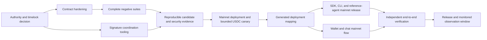

# REAPP Mainnet Delivery Roadmap

Status: planning baseline. Nothing in this document claims that a mainnet
contract, production wallet, or mainnet package release already exists.

This roadmap turns the current testnet toolkit into a production-oriented
mainnet release while preserving REAPP's core invariant:

> The MandateRegistry is the enforcement layer. SDK, CLI, agent, merchant,
> model, wallet UI, cache, and database state are untrusted inputs. Funds move
> only through an atomic contract call that validates and consumes the mandate
> before the token transfer completes.

The work is split across:

- `reapp-protocol-contracts`: contract authorization, token policy, storage,
  negative tests, reproducible artifacts, and deployment evidence;
- `reapp-protocol`: SDKs, CLI, reference agents, protocol adapters, release
  configuration, operations tooling, and the canonical evidence index;
- `reapp-protocol-demo`: wallet authorization, hosted chat experience, live
  transaction presentation, and end-to-end consumer flow.

No mainnet activation occurs until every blocking gate in this document has
objective evidence and no unresolved critical or high-severity finding.

## Definition of done

| Product outcome | Required evidence |
|---|---|
| MandateRegistry runs on Stellar mainnet | Published contract ID, network passphrase, verified USDC Stellar Asset Contract, WASM SHA-256, source commit, release tag, constructor arguments, live interface, and successful state reads all agree. |
| Privileged changes require 2-of-3 approval and delay | Three independent custodians, two distinct signatures required, timelock enforced on-chain, no single-key bypass, rotation and recovery rehearsed, and unauthorized cases continuously rejected. |
| A real USDC payment completes through REAPP | Mainnet transaction proves mandate registration, allowance, atomic `execute_payment`, exact asset and merchant binding, budget consumption, and independently verified delivery. |
| SDK, CLI, and agents operate on mainnet | Clean installs, typed imports, explicit mainnet selection, external signing, pinned release map, real low-value USDC canary, crash recovery, and reference-agent evidence. |
| The web app completes the consumer flow | User-controlled wallet signs the IntentMandate and Soroban authorization; the hosted chat agent purchases through the enforced path and displays mandate, receipt, remaining budget, and transaction evidence. |
| Independent verification is practical | Updated threat model and data-flow diagrams, complete negative-test matrix, reproducible build instructions, dependency and code scan reports, remediated findings, and a linear verification guide. |

## Release principles

1. **Contract authority is absolute.** No SDK result, cached mandate, model
   output, merchant claim, or database row authorizes movement of funds.
2. **Validation and consumption stay atomic.** The contract checks caller,
   merchant, asset, amount, expiry, pause state, remaining budget, and replay
   state in the same transaction that transfers value.
3. **Mainnet is explicit.** Testnet remains the default until a deliberate
   release changes that behavior. Mainnet requires `--network mainnet`, a known
   deployment entry, and visible real-value confirmation.
4. **Wallet and custody boundaries are visible.** The hosted app never receives
   a seed phrase. Team signing software coordinates signatures but never
   centralizes custodian secrets.
5. **Wire formats are adapters.** Bound-v2 and future x402 request/response
   formats translate into a stable internal payment intent. They do not alter
   MandateRegistry storage or enforcement semantics.
6. **Every claim has a fingerprint.** Contract, package, app, and document
   versions resolve to immutable hashes and exact source commits.
7. **Failure is closed and recoverable.** RPC, merchant, model, wallet, and
   storage failures must not create a second payment or unlock an unverified
   result.

## Decisions that must be recorded first

These are architecture decisions, not implementation details. Each receives a
short decision record with alternatives, risks, selected design, and testable
consequences.

### 1. Canonical 2-of-3 authority

Compare and prototype both supported models:

- a Stellar G-account with signer weights and a medium threshold requiring two
  of three signers; or
- an OpenZeppelin Stellar smart account using the simple-threshold policy with
  two of three independent signers.

The selected authority must be able to authorize the exact Soroban invocation
used by access-control, pause, rotation, and upgrade paths. The prototype must
prove two valid signer combinations, reject every one-signer combination,
reject unknown and duplicate signers, and document how signer-set and threshold
changes remain atomic.

Selection criteria:

- on-chain enforceability and least privilege;
- support for Soroban authorization entries;
- hardware-wallet and offline-signing compatibility;
- clear signer rotation and lost-key recovery;
- deterministic transaction assembly and verification;
- maintenance risk and dependency maturity.

### 2. One canonical delay authority

The current contract contains its own delayed same-address upgrade flow.
OpenZeppelin Stellar also provides access-control, upgrade, and timelock
components. The implementation must not blindly stack two independent delays
or leave parallel privileged routes.

Choose one canonical timelock authority and prove:

- every upgrade starts from an approved proposal;
- the operation identifier binds target contract, function, arguments, WASM
  hash, predecessor, salt, network, and earliest execution time;
- cancellation and execution roles are explicit;
- bootstrap authority is removed after configuration;
- no old administrator or alternate entry point can bypass the delay;
- pause authority cannot silently become upgrade authority;
- storage and interface compatibility are checked before execution.

### 3. Mainnet USDC identity

Use Circle's published Stellar mainnet asset identity:

- asset code: `USDC`;
- issuer:
  `GA5ZSEJYB37JRC5AVCIA5MOP4RHTM335X2KGX3IHOJAPP5RE34K4KZVN`.

Derive and independently verify the corresponding Stellar Asset Contract on
mainnet using official Stellar tooling during activation. Record the derived
contract ID and ledger evidence in the deployment manifest. Do not copy a
contract ID from an unverified third-party source.

The contract must allow only explicitly approved production asset contracts.
The SDK must read token decimals from chain and reject a conflicting caller
override.

### 4. Upgradeable window and terminal release

The early mainnet release remains upgradeable only behind the approved 2-of-3
authority and canonical timelock. A terminal non-upgradeable release is a
separate decision that requires:

- an exhaustive, current threat model;
- complete trust-boundary and data-lifecycle diagrams;
- all negative suites and live drills passing;
- an independent security review with all release-blocking findings closed;
- a migration and incident plan;
- explicit acceptance that future defects cannot be patched in place.

No document or UI may imply terminal immutability before that decision is made
and verified on-chain.

## Execution model

The gates are intentionally sequential where later work depends on immutable
outputs from earlier work. Parallel work is allowed only when it does not assume
an undecided contract interface, asset identity, or authority model.

## One-work-package-at-a-time execution queue

Use this queue as the operating order. Finish the tasks, evidence, and exit
condition for the active package before making the next package active. A later
package may be prototyped behind injected test configuration, but it cannot be
declared complete against an unfinished dependency.

### Work package 1 — Freeze the testnet baseline

**Build**

1. Tag the exact submitted testnet commits and record the package, contract,
   deployment, and hosted-app fingerprints.
2. Run the current full gate check unchanged.
3. Preserve the result as the regression baseline for every later change.
4. Create tracked work items from every unchecked box in this roadmap.

**Prove**

- all three repositories are clean at the recorded commits;
- testnet package and deployment mapping is internally consistent;
- the current contract, CLI demo, agents, and hosted experience still pass.

**Exit condition**

The baseline can be reproduced from a clean checkout and no future mainnet
change is allowed to remove its security coverage.

### Work package 2 — Select authority and delay architecture

**Build**

1. Prototype the G-account threshold and OpenZeppelin smart-account threshold
   alternatives on testnet.
2. Exercise real Soroban authorization entries for every privileged operation.
3. Select the 2-of-3 authority model and one canonical timelock.
4. Write the access-control graph, signer roles, rotation flow, and recovery
   decision records.

**Prove**

- A+B, A+C, and B+C can authorize;
- every one-signer, unknown-signer, duplicate-signer, and wrong-payload attempt
  fails;
- the selected design supports hardware-backed or offline signatures;
- no bootstrap or alternate administrator bypass remains.

**Exit condition**

The team has one approved authorization design with test evidence and named
custodians recorded privately.

### Work package 3 — Build the mainnet contract candidate

**Build**

1. Integrate OpenZeppelin access control and the selected timelock.
2. Add the verified USDC asset policy, TTL policy, stable events, storage
   versioning, and migration logic.
3. Preserve atomic mandate validation, budget consumption, and token transfer.
4. Generate typed bindings from the candidate interface.

**Prove**

- every contract function appears in the positive/negative matrix;
- unauthorized, expiry, overspend, replay, re-entry, token failure, TTL,
  migration, pause, authority, and upgrade suites pass;
- optimized WASM builds reproducibly to one SHA-256;
- generated bindings match the candidate interface.

**Exit condition**

There is one fingerprinted, reproducible contract candidate with no unresolved
critical or high-severity finding.

### Work package 4 — Build signing and operations tooling

**Build**

1. Produce immutable signing-request bundles.
2. Add independent signature verification and deterministic envelope assembly.
3. Write pause, upgrade, cancellation, rotation, loss, compromise, and recovery
   runbooks.
4. Add read-only commands that verify contract, role, timelock, and pending
   operation state.

**Prove**

- the coordinator cannot alter a signed payload;
- signatures for a different network, sequence, simulation, WASM, or operation
  fail;
- secrets never enter the coordinator, logs, repository, or CI;
- every operational runbook succeeds in a testnet rehearsal.

**Exit condition**

Two independent custodians can safely create and execute each permitted
operation from documented steps.

### Work package 5 — Complete production SDK and CLI behavior

**Build**

1. Add explicit mainnet network handling behind an injected candidate
   deployment.
2. Add external signer support, chain-derived decimals, mandate-derived
   allowance expiry, and known-deployment guards.
3. Finish durable shared redemption, result/outbox, encryption, and
   observability interfaces.
4. Generate all version and deployment tables from the single release manifest.
5. Add explicit mainnet behavior to every CLI command.

**Prove**

- clean package install, typed import, and CLI execution pass;
- unknown, testnet, stale, and conflicting production mappings fail;
- package, specification, contract, deployment, and app versions cannot be
  confused;
- the SDK cannot deliver value by skipping contract validation and consumption.

**Exit condition**

The SDK and CLI are ready to consume a final mainnet deployment manifest without
source changes.

### Work package 6 — Harden the reference agents

**Build**

1. Move the consumer to external wallet or signer authorization.
2. Move the merchant to shared linearizable redemption and durable immutable
   fulfillment.
3. Keep wire-format translation in a versioned adapter.
4. Add documented safe and unsafe implementation examples.

**Prove**

- all failure drills pass across process restart and multiple instances;
- an observed or stale proof cannot be redeemed by another requester;
- post-payment delivery recovery never creates a second payment;
- rogue-agent activity stops at the contract budget.

**Exit condition**

Both agents are production-shaped and remain fully usable on testnet before any
real-value activation.

### Work package 7 — Build the wallet and chat application

**Build**

1. Connect a user-controlled Stellar wallet through a replaceable adapter.
2. Implement IntentMandate review, signing, registration, status, and
   revocation.
3. Implement the typed purchase tool with Vercel AI SDK and the matching
   assistant-ui runtime.
4. Add durable tool state, receipts, transaction links, budget display,
   recovery, and production browser controls.

**Prove**

- the app and server never receive seed material;
- wrong network, cancellation, modified authorization, expiry, and outage fail
  safely;
- prompt or tool manipulation cannot bypass the mandate;
- the same testnet contract path works from wallet through chat to fulfillment.

**Exit condition**

The hosted candidate completes the full testnet flow and is ready to switch only
through the generated deployment manifest.

### Work package 8 — Complete security evidence

**Build**

1. Update the threat model and every data-flow diagram to the exact candidate.
2. Run source, dependency, secret, artifact, and reproducibility scans.
3. Complete an independent security review.
4. Remediate each finding and attach a regression test.
5. Write the clean-checkout verification guide.

**Prove**

- every identified threat maps to a mitigation and evidence;
- every finding has closure evidence or an explicit non-blocking disposition;
- an independent verifier reproduces the build and gate check.

**Exit condition**

The evidence index is complete and no release-blocking finding remains.

### Work package 9 — Deploy and verify a bounded mainnet canary

**Build**

1. Reverify USDC, network, candidate WASM, roles, threshold, timelock, and
   constructor arguments.
2. Deploy through the approved 2-of-3 process.
3. Read all critical state independently before funding.
4. Execute one short-lived, low-value real USDC mandate and payment.
5. Generate the final deployment manifest from observed chain state.

**Prove**

- deployed bytecode and configuration match the signed manifest;
- unauthorized probes fail;
- mandate consumption, balances, events, receipt, and recovery all agree;
- the canary cannot spend beyond its exact budget or expiry.

**Exit condition**

The generated mainnet manifest is complete, verified, and safe to publish as the
only production configuration source.

### Work package 10 — Release SDK, CLI, agents, and hosted app

**Build**

1. Publish exact packages with provenance.
2. Activate the verified deployment manifest in SDK, CLI, and agents.
3. Deploy the wallet/chat app from an immutable source revision.
4. Enable monitoring and incident response.

**Prove**

- clean users can install packages and run typed imports;
- the canonical CLI flow completes a bounded real USDC payment;
- both reference agents use the same contract and asset;
- the hosted wallet/chat flow completes a bounded real USDC payment;
- all public release facts match the generated manifest.

**Exit condition**

An independent reviewer can navigate the repositories, reproduce the gate
checks, verify the chain state, and complete both terminal and hosted flows.

### Work package 11 — Observe before expanding

**Build**

1. Keep initial budgets and traffic bounded.
2. Monitor authority, upgrade, pause, payment, replay, RPC, reconciliation,
   storage, and application signals through the defined observation window.
3. Run the incident and key-recovery drills against production procedures
   without exposing funds or secrets.
4. Record the separate decision on whether and when terminal immutability is
   appropriate.

**Prove**

- no unexplained mapping, settlement, reconciliation, or authority discrepancy;
- alerts and escalation reach the expected operators;
- rollback, pause, recovery, and communication procedures remain executable.

**Exit condition**

Limits increase only through an explicit go/no-go decision backed by the
observation evidence.

## Detailed delivery gates

### Gate 0 — Baseline and ownership

- Freeze the submitted testnet release as the regression baseline.
- Create an issue for every item in this roadmap and assign one responsible
  owner plus one verifier. Names are required before implementation starts;
  this document does not invent them.
- Record the selected 2-of-3 architecture and canonical delay design.
- Record signer roles:
  - Custodian A: primary operator using a hardware-backed key;
  - Custodian B: independent technical custodian;
  - Custodian C: independent recovery custodian.
- Confirm no person or device controls two custodian keys.
- Define mainnet RPC providers, alert destinations, escalation order, spending
  limits, canary amounts, and emergency stop authority.
- Define retention and encryption rules for mandates, receipts, transaction
  envelopes, logs, and chat history.

Exit evidence:

- accepted decision records;
- named ownership matrix stored privately;
- public role model without personal or secret data;
- testnet regression baseline fingerprinted by exact commits and releases.

### Gate 1 — Contract hardening

Implement the chosen OpenZeppelin Stellar access-control and timelock design in
`reapp-protocol-contracts`.

Required contract work:

- define least-privilege roles for proposal, cancellation, execution, emergency
  pause, unpause, role administration, and signer rotation;
- require 2-of-3 authorization for upgrades and every path that can replace or
  expand privileged authority;
- allow only the verified mainnet USDC Stellar Asset Contract at activation;
- preserve exact merchant, agent, asset, amount, expiry, and mandate-id binding;
- preserve atomic validate-and-consume before the SEP-41 transfer;
- align allowance lifetime and contract storage lifetime with mandate expiry;
- extend instance and persistent storage TTL safely without reviving expired
  authority;
- emit stable, documented events for registration, consumption, revocation,
  pause, role changes, upgrade scheduling, cancellation, and execution;
- version storage explicitly and test migration from the current deployed
  schema;
- expose read-only state required for independent verification without exposing
  secrets.

Required negative tests for every relevant contract function:

- unauthorized caller and unauthorized role;
- one-of-three approval;
- unknown, duplicate, removed, or expired signer;
- expired, revoked, exhausted, wrong-agent, wrong-merchant, wrong-asset, and
  wrong-amount mandate;
- amount of zero, negative-equivalent decode, overflow boundary, and overspend;
- replay of a mandate hash, authorization entry, transaction, and upgrade
  operation;
- execution before delay, execution without pause, changed WASM hash, changed
  arguments, cancelled operation, and second execution;
- unauthorized role assignment, role revocation, signer rotation, pause, unpause,
  and terminal authority change;
- malicious token callback/re-entry and transfer failure;
- storage TTL boundary before, at, and after expiry;
- schema migration with representative live records.

Exit evidence:

- every public function appears in the positive/negative coverage matrix;
- deterministic test suite passes from a clean checkout;
- optimized WASM is reproducible and fingerprinted;
- no unresolved critical or high-severity finding;
- compatibility report proves the SDK binding matches the final interface.

### Gate 2 — Custody and signature coordination

Build signature-coordination tooling in `reapp-protocol` around official Stellar
transaction and Soroban authorization primitives.

The tool produces an immutable signing request containing:

- network passphrase and RPC endpoint identity;
- source account, sequence, fee, time bounds, and ledger bounds;
- target contract, function, typed arguments, and authorization tree;
- simulated transaction data and resource fee;
- proposed WASM SHA-256 and source release fingerprint;
- timelock operation identifier and earliest execution time;
- human-readable effect summary;
- hash of the complete signable payload.

Each custodian verifies the same request independently. The coordinator:

- accepts only signatures for the exact payload hash;
- verifies signer identity and uniqueness before assembly;
- refuses changed simulation output, sequence, fee, time bounds, authorization
  tree, target, or arguments;
- never requests, stores, logs, or transmits private keys;
- does not append unnecessary signatures;
- outputs a final envelope and manifest that can be independently checked before
  broadcast.

Required rehearsals on testnet:

- A+B and B+C authorize successful operations;
- A+C authorizes at least one successful operation;
- every single signer fails;
- wrong payload, network, sequence, hash, and expired request fail;
- key rotation retains two-key operability before the old key is removed;
- one lost key follows the written recovery path;
- pause, unpause, schedule, cancel, and execute follow their intended roles;
- a compromised-key drill demonstrates containment without exposing secrets.

Exit evidence:

- signed rehearsal manifests and transaction hashes;
- key-generation, backup, rotation, loss, compromise, and recovery runbooks;
- no team secret in repository history, CI, logs, or hosted configuration.

### Gate 3 — SDK, CLI, and network configuration

Add mainnet support in `reapp-protocol` without changing the enforcement
boundary.

SDK requirements:

- add a known-deployments registry keyed by explicit network identity;
- publish the mainnet entry only after Gate 5 fixes the contract ID, WASM hash,
  USDC contract, deployment ledger, and source commit;
- reject unknown or conflicting mainnet contract and asset overrides by default;
- obtain token decimals from chain and bind them into signed challenges;
- derive allowance expiration from mandate expiry;
- accept an external signer interface instead of requiring raw secret strings;
- keep SDK-side validation as fail-fast usability only;
- keep bound-v2 isolated behind an adapter interface so future x402 shapes do
  not change mandate storage or contract methods;
- use a shared linearizable redemption store and durable result/outbox for
  multi-instance fulfillment;
- encrypt sensitive receipts at rest and redact authorization material from
  logs.

CLI requirements:

- support explicit `--network mainnet` throughout setup, mandate creation,
  payment, recovery, status, and demo commands;
- require a real-value confirmation unless a documented non-interactive
  production policy authorizes a bounded canary;
- show network, contract, asset, merchant, maximum amount, expiry, estimated
  fee, and signer source before authorization;
- refuse testnet keys, testnet contracts, unknown assets, and ambiguous network
  aliases in mainnet mode;
- support hardware or external signers without printing secret material;
- preserve the pre-broadcast journal and exact-hash reconciliation path;
- return machine-readable results in addition to human-readable output.

Canonical verification command after release:

```bash
npx --yes reapp-protocol-cli@<pinned-version> \
  demo research-agent \
  --network mainnet \
  --asset usdc
```

The command must not silently substitute testnet, an old contract, or a
different package release.

#### Version and deployment mapping gate

Package versions, protocol profile versions, contract releases, deployments,
and hosted app revisions are separate axes. A single generated release manifest
must map:

- every npm package name, version, tarball integrity, and source commit;
- CLI package version and installed binary names;
- bound-v2 and AP2 profile versions;
- network passphrase and RPC network identity;
- contract release, mainnet contract ID, WASM SHA-256, and deployment ledger;
- USDC code, issuer, derived Stellar Asset Contract, and decimals;
- demo deployment URL and source revision.

CI must generate the public tables from that manifest, compare SDK defaults and
CLI output to it, install every exact package into clean directories, and fail
on any mismatch. This gate specifically prevents a package version from being
mistaken for a specification version and prevents the website, README, SDK,
CLI, or contract explorer links from pointing at different releases.

Exit evidence:

- exact packages install and typed imports compile in clean environments;
- CLI help and commands show the same generated mapping;
- mainnet mode refuses every mismatched or stale mapping fixture;
- testnet behavior remains covered and unchanged.

### Gate 4 — Reference agents and failure drills

Upgrade both reference agents in `reapp-protocol` as exemplary production
patterns.

Consumer agent:

- accepts a user-controlled external signer;
- creates a mandate with explicit merchant, USDC asset, budget, and expiry;
- uses `agent.fetch()` through the current adapter;
- journals before broadcast and recovers by exact transaction hash;
- never retries payment to recover delivery;
- displays budget consumed and remaining from chain state.

Fulfillment agent:

- signs exact origin, method, path/query, amount, asset, network, registry, and
  recency in the challenge;
- independently verifies transaction success, registry-emitted event, transfer,
  caller binding, and request binding;
- atomically claims the proof in a shared linearizable store;
- persists immutable fulfillment before acknowledging success;
- returns the same result for a valid retry;
- fails closed when RPC, database, or verification state is uncertain.

Required live testnet drills:

- agent spends repeatedly within budget, then the next overspend fails on-chain;
- merchant is unavailable before settlement;
- merchant becomes unavailable after settlement and exact recovery delivers
  without a second payment;
- mandate expires before payment;
- mandate expires between quote and attempted settlement;
- mandate is revoked while the agent is active;
- RPC is unavailable or inconsistent;
- fulfillment instance restarts and a second instance receives the retry;
- observed transaction proof is replayed by another requester;
- stale challenge, wrong origin, wrong route, wrong merchant, wrong asset, and
  old wire-format fixtures fail.

Exit evidence:

- machine-readable drill output with exact commits and transaction hashes;
- documented user experience and recovery action for each case;
- unsafe alternatives are called out next to the safe code pattern.

### Gate 5 — Mainnet deployment and bounded canary

Deployment is a controlled operation, not a documentation edit.

Before broadcast:

- all earlier gates pass on the exact release commit;
- the optimized WASM hash matches the reviewed artifact;
- all three custodian public keys and roles match the approved manifest;
- the chosen authority and timelock configuration have been rehearsed;
- Circle's USDC asset identity and the derived Stellar Asset Contract are
  independently reverified;
- RPC network passphrase and chain identity match mainnet;
- constructor arguments and initial roles are independently reviewed;
- rollback, pause, communication, and migration runbooks are active;
- canary wallets contain only the approved low-value amount.

After deployment:

- verify contract executable hash, interface, roles, threshold, delay, pause
  state, allowed asset, and empty initial state directly from chain;
- execute unauthorized probes before funding a payment mandate;
- register one short-lived, tightly bounded mandate;
- execute the smallest practical real USDC payment through MandateRegistry;
- independently verify balances, events, budget consumption, and receipt;
- test exact recovery without a second payment;
- publish only non-secret fingerprints and transaction evidence;
- pause expansion if any observed value differs from the signed manifest.

Exit evidence:

- mainnet deployment manifest;
- contract explorer link and source release;
- canary transaction and independent verification report;
- generated network configuration consumed unchanged by SDK and CLI.

### Gate 6 — Wallet and chat application

Build the hosted consumer experience in `reapp-protocol-demo`.

Wallet boundary:

- connect through a replaceable Stellar wallet adapter;
- show account, network, contract, merchant, USDC amount, maximum budget, and
  expiry before signing;
- user signs the IntentMandate and required Soroban authorization with the
  wallet;
- seed phrases and secret keys never enter the application, server, telemetry,
  or support flow;
- reject wrong-network accounts and stale or modified authorization payloads;
- display pending, confirmed, failed, and recoverable states distinctly.

Agent boundary:

- use the current Vercel AI SDK tool interface behind an adapter owned by the
  application;
- use assistant-ui's matching current runtime for the chat surface;
- expose a narrowly typed purchase tool whose server implementation receives a
  validated quote and an already-authorized mandate reference;
- treat model text and tool arguments as untrusted;
- read remaining budget and expiry from authoritative state before presenting
  the action;
- rely on MandateRegistry, not the model or UI, to enforce the payment;
- make tool calls idempotent and resumable across disconnects.

User-visible flow:

1. Connect a mainnet wallet.
2. Select an approved merchant, budget, and expiry.
3. Review and sign the IntentMandate.
4. Register the mandate on Soroban.
5. Ask the agent for paid research.
6. Review the signed merchant challenge and proposed USDC amount.
7. Let the agent execute within the mandate.
8. See the source, receipt, transaction, spent amount, and remaining budget.
9. Revoke or let the mandate expire.

Application safeguards:

- authenticated sessions, CSRF protection, strict CSP, secure cookies, rate
  limits, dependency pinning, and secret scanning;
- durable chat and tool-call state with idempotency keys;
- server-side allowlist for production merchants and contract identities;
- no sensitive authorization material in analytics or model prompts;
- clear real-value warnings and bounded defaults;
- accessibility, mobile layout, empty/error states, and explorer links;
- hosted revision fingerprint visible in a product diagnostics page.

Exit evidence:

- hosted mainnet URL tied to an immutable source revision;
- browser-level flow passes with a funded user-controlled wallet;
- wallet rejection, wrong network, cancelled signing, expired mandate, merchant
  outage, and post-payment recovery are demonstrated;
- a real low-value USDC payment completes through the same contract path used by
  the CLI and reference consumer.

### Gate 7 — Security evidence and independent verification

Update the current security material to the exact mainnet candidate:

- threat model covering contract, smart-account or threshold-account authority,
  timelock, token contract, RPC, SDK, CLI, merchant, stores, wallet, web
  application, model/tool boundary, dependencies, deployment, and operators;
- data-flow diagrams for mandate signing, registration, allowance, payment,
  fulfillment, exact recovery, revocation, pause, upgrade, key rotation, and
  incident response;
- trust-boundary table naming every authoritative and non-authoritative source;
- function-by-function positive and negative coverage matrix;
- CodeQL, OSV-Scanner, `cargo deny`, `cargo vet`, Semgrep where applicable,
  secret scanning, dependency review, SBOM generation, and reproducible build
  reports;
- manual review of access-control graph, storage migration, arithmetic, token
  callbacks, authorization entries, transaction assembly, replay domains,
  wallet boundary, and deployment scripts;
- independent external security review with findings, severity, remediation
  commit, regression test, and closure evidence;
- public verification guide that starts from a clean checkout and does not
  require privileged credentials for read-only checks.

Any unresolved critical or high-severity finding blocks activation. Lower
severity findings require an explicit owner, rationale, containment, and target
date; silence is not acceptance.

Exit evidence:

- complete evidence index referencing immutable artifacts;
- every finding is closed or explicitly dispositioned;
- an independent verifier reproduces the build, tests, deployment mapping, and
  read-only mainnet checks without team assistance.

### Gate 8 — Release and monitoring

- Publish exact npm versions with provenance and immutable tarball integrity.
- Publish the generated mainnet deployment mapping and SDK configuration.
- Run clean-install and typed-import checks against the public registry.
- Run the canonical CLI command with real low-value USDC.
- Run the hosted wallet/chat flow against the same contract and package map.
- Verify `reapp.live`, package READMEs, CLI output, demo diagnostics, and
  contract documentation all show the same generated release facts.
- Enable alerts for pause state, role changes, signer changes, scheduled and
  executed upgrades, rejected-payment spikes, RPC divergence, store errors,
  reconciliation backlog, and abnormal spend patterns.
- Define the observation window and explicit go/no-go authority before raising
  budgets or traffic.

## Evidence manifest

The release evidence directory should contain a machine-readable manifest plus
human-readable index. At minimum:

```text
release/
  mainnet-release.json
  checksums.txt
  sbom/
  scans/
  tests/
  drills/
  deployment/
    contract.json
    roles.json
    usdc.json
    canary.json
  packages/
    npm-integrity.json
  app/
    deployment.json
  verification.md
```

`mainnet-release.json` is the single source of truth. Generated documentation
must never be edited independently of that manifest.

Required fingerprints:

- repository and commit for every source artifact;
- build environment and locked dependency graph;
- optimized WASM SHA-256;
- contract ID, deployment transaction, ledger, network passphrase, and
  constructor arguments;
- access-control role members, threshold, timelock duration, and bootstrap-role
  removal transaction;
- USDC code, issuer, Stellar Asset Contract, decimals, and verification ledger;
- package names, versions, tarball integrity, provenance, and source commits;
- CLI binary names and version output;
- hosted application URL, deployment ID, source revision, and configuration
  fingerprint;
- gate-check command, environment, start/end time, and result.

## Continuous gate check

The exact candidate commit must pass, in order:

1. formatting, linting, type checking, and unit tests;
2. complete contract positive and negative suites;
3. access-control, timelock, upgrade, storage migration, token, and re-entry
   suites;
4. protocol adapter and version/deployment mapping suites;
5. SDK, CLI, middleware, and reference-agent integration suites;
6. package build, pack, clean install, typed import, and CLI execution;
7. wallet/chat unit, integration, browser, accessibility, and recovery suites;
8. dependency, source, secret, and artifact scans;
9. reproducible WASM and package fingerprint comparison;
10. live testnet drills;
11. read-only mainnet configuration verification;
12. bounded mainnet canary only after all prior checks pass.

CI must run the non-live subset on every change. Scheduled testnet drills catch
RPC, dependency, and integration drift. Mainnet writes require the separate
2-of-3 operational process and are never triggered by ordinary pull requests.

## Critical path



The SDK and demo can develop against an injected candidate configuration, but
neither may publish a production default until the deployed contract manifest
exists.

## Risk register

| Risk | Preventive control | Required proof |
|---|---|---|
| Evolving x402 shape | Stable internal payment intent plus versioned adapters | Old, current, malformed, and future-fixture tests leave contract behavior unchanged |
| SDK bypasses chain enforcement | Contract-only payment path; no delivery from SDK precheck | Direct-call and bypass attempts fail or still invoke atomic contract enforcement |
| Single-key privileged action | 2-of-3 authority on every upgrade/authority mutation path | All one-key and unauthorized-role tests fail |
| Timelock bypass or duplicate authority | One canonical delay and complete access graph | Early, alternate-path, replay, and bootstrap-admin probes fail |
| Wrong USDC or decimals | Official asset identity, derived SAC, on-chain decimals, allowlist | Manifest and chain reads agree; conflicting overrides fail |
| Version/config mapping drift | Generated single-source release manifest | Website, README, SDK, CLI, packages, explorer links, and app revision match |
| Duplicate payment after failure | Pre-broadcast journal, exact-hash reconciliation, immutable result replay | Post-settlement outage recovers without another payment |
| Multi-instance proof replay | Shared linearizable claim store | Concurrent and restart drills produce one fulfillment |
| Model initiates unsafe action | Narrow typed tools, bounded mandate, server validation, contract authority | Prompt/tool manipulation cannot exceed mandate |
| Hosted app handles a secret | Wallet-only signing and telemetry redaction | Secret scans and browser/server traces contain no seed material |
| Lost or compromised custodian key | Independent keys, documented rotation/recovery, rehearsals | Two-key operability and containment drill |
| Irreversible defect | Upgradeable observation window; terminal release is a separate decision | Explicit terminal-release checklist and sign-off |

## Repository work map

### `reapp-protocol-contracts`

- OpenZeppelin access-control and selected timelock integration;
- 2-of-3 authority compatibility and authorization-entry tests;
- USDC asset policy, TTL policy, storage versioning, and migration;
- exhaustive negative suites and coverage matrix;
- reproducible optimized WASM, SBOM, scan outputs, and release metadata;
- deterministic deployment and live read-only verification scripts.

### `reapp-protocol`

- canonical release/deployment manifest and generators;
- mainnet-aware Stellar binding, SDK, middleware, AP2 adapter, and CLI;
- external signer and hardware/offline signing interfaces;
- signature-coordination tool and operational runbooks;
- durable redemption/result stores, encryption, and observability hooks;
- safe mainnet reference agents and failure drills;
- package publication, clean-install, and end-to-end gate checks;
- mainnet threat model, data flows, evidence index, and verification guide.

### `reapp-protocol-demo`

- Stellar wallet adapter and network guard;
- IntentMandate review, signing, registration, revocation, and status UI;
- Vercel AI SDK tool flow with the matching assistant-ui runtime;
- mandate-aware chat, receipts, remaining-budget presentation, and recovery;
- durable tool-call state, browser security controls, and diagnostics;
- hosted mainnet deployment and browser-level evidence.

## Completion checklist

### Contract and authority

- [ ] OpenZeppelin access-control integration is implemented and documented.
- [ ] One canonical timelock protects every upgrade.
- [ ] Two of three independent custodians are required.
- [ ] Key ownership, rotation, loss, compromise, and recovery are documented.
- [ ] Mainnet USDC is the only activated production asset.
- [ ] TTL, migration, pause, and upgrade behavior pass boundary tests.
- [ ] Every public function has unauthorized and invalid-state coverage.
- [ ] Candidate WASM is reproducible and fingerprinted.

### SDK, CLI, and agents

- [ ] Mainnet selection is explicit and fail-closed.
- [ ] External signing replaces raw-secret requirements.
- [ ] On-chain decimals and mandate-derived allowance expiry are used.
- [ ] Known deployment and asset guards reject mismatches.
- [ ] Wire-format adapters remain decoupled from mandate enforcement.
- [ ] Shared durable stores and exact recovery pass multi-instance drills.
- [ ] CLI and both reference agents complete a real bounded USDC flow.
- [ ] Exact npm packages install, import, and run from clean environments.
- [ ] The generated mapping prevents the version/config mismatch class.

### Wallet and chat

- [ ] User wallet signs without sharing seed material.
- [ ] IntentMandate registration, status, and revocation are visible.
- [ ] Model/tool input is treated as untrusted.
- [ ] Chat payment invokes the same enforced path as CLI and SDK.
- [ ] Receipts, explorer links, spent amount, and remaining budget are visible.
- [ ] Wrong-network, rejection, expiry, outage, and recovery states are tested.
- [ ] Hosted revision and runtime configuration are fingerprinted.

### Security and release

- [ ] Threat model and data flows match the exact mainnet candidate.
- [ ] Live failure drills are documented with objective evidence.
- [ ] Source, dependency, secret, and artifact scans are clean.
- [ ] Independent security review findings are closed.
- [ ] An external verifier reproduces tests and read-only chain checks.
- [ ] Mainnet deployment and canary manifests are complete.
- [ ] Public docs, packages, CLI, site, and explorer facts match one manifest.
- [ ] Monitoring and incident response are active before limits are raised.
- [ ] Any terminal non-upgradeable release follows a separate explicit gate.

## Official implementation references

- [OpenZeppelin Stellar Contracts](https://docs.openzeppelin.com/stellar-contracts)
- [OpenZeppelin Stellar access control](https://docs.openzeppelin.com/stellar-contracts/access/access-control)
- [OpenZeppelin Stellar timelock controller](https://docs.openzeppelin.com/stellar-contracts/governance/timelock-controller)
- [OpenZeppelin Stellar upgradeable utility](https://docs.openzeppelin.com/stellar-contracts/utils/upgradeable)
- [OpenZeppelin Stellar smart-account policies](https://docs.openzeppelin.com/stellar-contracts/accounts/policies)
- [Stellar signatures and multisig](https://developers.stellar.org/docs/learn/fundamentals/transactions/signatures-multisig)
- [Stellar transaction guide](https://developers.stellar.org/docs/build/guides/transactions)
- [Signing Soroban invocations](https://developers.stellar.org/docs/build/guides/transactions/signing-soroban-invocations)
- [Stellar CLI manual](https://developers.stellar.org/docs/tools/cli/stellar-cli)
- [Stellar Asset Contract deployment](https://developers.stellar.org/docs/tools/cli/cookbook/deploy-stellar-asset-contract)
- [Circle USDC contract addresses](https://developers.circle.com/stablecoins/usdc-contract-addresses)
- [Vercel AI SDK tool calling](https://ai-sdk.dev/docs/ai-sdk-core/tools-and-tool-calling)
- [assistant-ui Vercel AI SDK runtime](https://www.assistant-ui.com/docs/runtimes/ai-sdk/v7)
