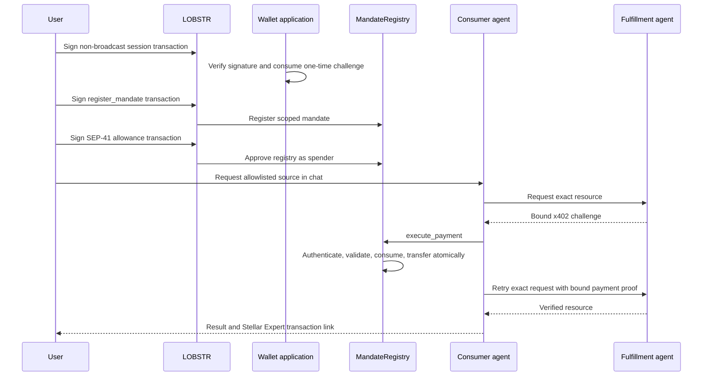

# Wallet and consumer chat application

`apps/wallet-chat` is the hosted Next.js reference flow for LOBSTR mandate
signing and contract-enforced agent payments. It uses Vercel AI SDK for model
streaming and tool execution and assistant-ui for the accessible chat runtime.

## Authority flow

The preliminary contract read improves error messages but grants no authority.
The sole payment path remains the atomic contract invocation.

## Wire-format isolation

x402 parsing, challenge binding, and proof encoding remain in the SDK adapter.
The wallet application consumes `agent.fetch()` and does not duplicate that
wire format. A future x402 request or response shape can be implemented in the
adapter without changing IntentMandate fields or MandateRegistry storage and
execution semantics.

## Safe reference pattern

- sign registration and allowance in the user's wallet;
- approve the contract, never the agent or application;
- bind server tools to a fixed catalog and merchant origin;
- read current chain state only for fail-fast feedback;
- move money only through `execute_payment`;
- save an exact settlement receipt before broadcast;
- persist the delivered result before acknowledging the receipt;
- expose chain evidence for every broadcast transaction; and
- revoke the mandate on-chain when the user ends authority.

Unsafe patterns include trusting a cached mandate, transferring directly from
the agent, approving the agent as token spender, letting the model choose an
arbitrary URL or amount, retrying an uncertain settlement as a new payment, or
hardcoding an unverified mainnet deployment.

## Release gate

Mainnet hosting is blocked until the deployment manifest passes the SDK parser,
the exact application source commit is pinned, durable state is configured,
and the full contract, package, reference-agent, failure-drill, dependency, and
hosted-flow evidence passes from a clean checkout.
